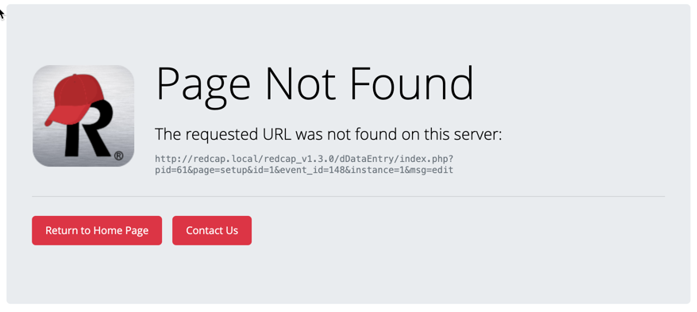

# REDCap Redirect
A method to handle outdated REDCap version urls and automagically redirect users to the indended resource

## About
If you upgrade REDCap often, you will start to accumulate many versions of REDCap code on your web server.  If someone hits a file via a bookmark from an older version of REDCap, the software will automatically redirect the request to the currently installed version.  However, if you ever remove old versions of REDCap from the webserver (which may be done out of securty concerns or due to simple house cleaning) an older url will not resolve and the user will receive a 404 Error message.

These method is intended to solve this problem and redirect users to the intended page.  It uses Apache's mod_rewrite and a php script to 'fix' these outdated urls and as such will only work for users of Apache (v2.4 or greater with mod_rewrite installed).

## How it works
If your apache server receives a request for a url that isn't on disk AND the url looks like a REDap url, it will try to replace the version in the url to match the current version as defined in your database.

- For example, let's say you upgraded servers and decided to get rid of old versions in your webroot.  A user then tries to hit which was bookmarked in their browser:
`https://redcap.stanford.edu/redcap_v8.1.0/index.php?pid=10601`
The rewrite rule finds that /redcap_v8.1.0/index.php is NOT a valid file but has a 'redcap_vx.y.z' in it so it passes it to the redcap_redirect.php script which queries the database and determines that your redcap version is actually 9.2.5.  So, it redirects the user to:
`https://redcap.stanford.edu/redcap_v9.2.5/index.php?pid=10601`

- If a url does NOT contain redcap_vx.y.z the rewrite rule will not take effect and the user will get the default Apache 404 error.

- If a url redcap version is updated, but the file with the new version does not exist, the user will get a nice custom 404 error message:


## How to install
1. Copy the redcap_redirect.php script into your redcap webroot directory.  It should sit along-side `database.php`, `cron.php`, etc...
### Apache Install
1. Edit your apache configuration to include a block of mod_rewrite code.  This can be done either with a .htaccess file placed in your webroot or by modifying the actual `.conf` file for your site.  The code should look like:
```
<IfModule mod_rewrite.c>
    RewriteEngine on
    # Check if the requested file does not exist on the server
    RewriteCond %{DOCUMENT_ROOT}/$1 !-f
    RewriteCond %{DOCUMENT_ROOT}/$1 !-d
    # Check that the requested URI looks like a REDCap URI
    RewriteCond %{REQUEST_URI} "^.*\/redcap_v(\d+\.\d+\.\d+)\/.*$"
    # Redirect to this script to handle the version substitution
    RewriteRule "^(.+)$"   "/redcap_redirect.php"   [PT,L,NS]
</IfModule>
```

1. Please note that if your redcap webroot directory is not the same as the server's document root then you may need to modify the `RewriteRule...` line above and prefix the path to redcap_redirect.php with your REDCap's document root.  For example, if your redcap base-server url is `https://www.school.edu/redcap/` then you may need to make the third argument to the rewrite rule look as `"/redcap/redcap_redirect.php"`.

#### Requirements
This will only work on servers running Apache 2.4 or higher with the mod_rewrite module enabled.

#### How can I tell if mod_rewrite is enabled?
Create a php page as:
```php
<?php
phpinfo();
```
and in the result you should see mod_rewrite.  If it is not enabled, you may have to enable it.  In my case this was done with
```
a2enmod rewrite
```

### NGINX on Azure Managed Web App Install
*Based on this [Microsoft Blog post](https://techcommunity.microsoft.com/t5/apps-on-azure-blog/configure-nginx-for-php-8-linux-azure-app-service/ba-p/3069373) and [Tony Jin's comments in REDCap Community](https://techcommunity.microsoft.com/t5/apps-on-azure-blog/configure-nginx-for-php-8-linux-azure-app-service/ba-p/3069373).*

1. Using SSH session, copy default file from **/etc/nginx/sites-enabled/default** to the **/home** folder:
   ```
   cp /etc/nginx/sites-enabled/default /home/default
   ```
2. Edit using VI or download default and modify it there.
3. Make these edits to default as suggested by Tony.Jin: "As for the NGINX config, we simply added try_files $uri redcap_redirect.php to the two "location" blocks below"
   ```
   location / {
   # ... other configs... #
   try_files $uri $uri/ /redcap_redirect.php;
   }
   ```
   and
   ```
   location ~ [^/]\.php(/|$) {
   # ... other configs... #
   try_files $uri /redcap_redirect.php;
   }
   ```   
   
4. Save your edits back to the **default** file in the **home** folder.
5. Open the REDCap Web App in the Azure portal and navigate to the **Configuration page** (under Settings).
6. Click on **General Settings** and add the following to the Startup Command textbox and click Save:
   ```
   cp /home/default /etc/nginx/sites-enabled/default; service nginx restart
   ```      

### IIS Install
(reported by Tony Jin here: https://community.projectredcap.org/questions/73262/redirect-to-latest-version-of-redcap.html?childToView=78819#answer-78819 ) 

```
<rewrite>
	<rules>
		<rule name="redirect redcap old version paths" enabled="true" stopProcessing="true">
			<match url="^(.+)$" />
			<conditions>
				<add input="{REQUEST_FILENAME}" matchType="IsFile" negate="true" />
				<add input="{REQUEST_FILENAME}" matchType="IsDirectory" negate="true" />
				<add input="{REQUEST_URI}" pattern="^.*\/redcap_v(\d+\.\d+\.\d+)\/.*$" />
			</conditions>
			<action type="Rewrite" url="/redcap_redirect.php" appendQueryString="false" />
		</rule>
	</rules>
</rewrite>
```

## Requirements
This will only work on servers running Apache 2.4 or higher with the mod_rewrite module enabled.

### How can I tell if mod_rewrite is enabled?
Create a php page as:
```php
<?php
phpinfo();
```
and in the result you should see mod_rewrite.  If it is not enabled, you may have to enable it.  In my case this was done with
```
a2enmod rewrite
```
